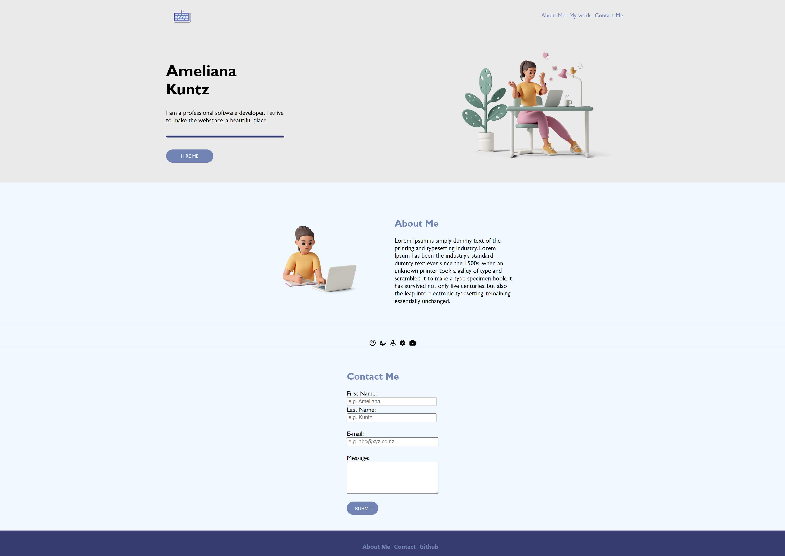

# Personal Portfolio

This is a personal website created while following code along tutorial by Ania Kubow [12HR+ YouTube Coding Bootcamp 2021!](https://www.youtube.com/watch?v=Xm4BObh4MhI&t=10264s). 

## Overview

This is an lightweight personal portfolio site, created with HTML, and CSS to learn basics.

### Screenshot

#### Live Demo 
[Site Demo]( https://tech-neophile.github.io/Personal-Portfolio-1/)

### Built with

- Semantic HTML5 markup
- CSS custom properties
- Flexbox

# 🚀HappyCoding